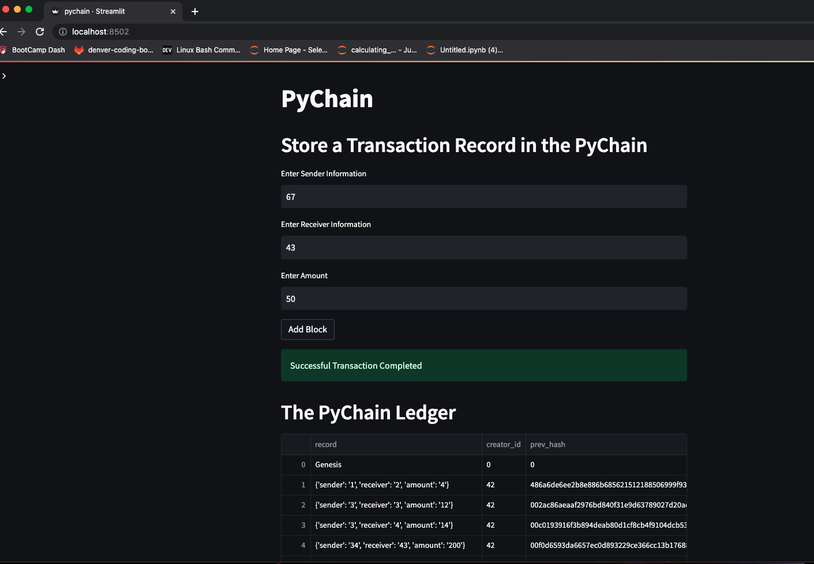
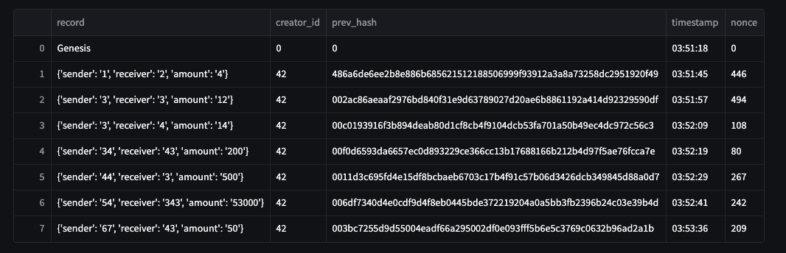
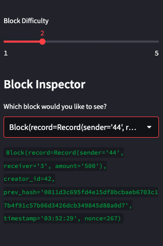
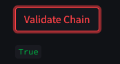

# The Block Ledger

This is a Visual Studio notebook that creates a block chian ledger. It builds a blockchain-based ledger system, complete with a user-friendly web interface using streamlit. This ledger allows partner banks to conduct financial transactions (that is, to transfer money between senders and receivers) verifies the integrity of the data in the ledger. I have included pictures of the interface as well. 
---

## Technologies

This project leverages python 3.7 with the following packages:

* [pandas](https://github.com/pandas-dev/pandas) - For the command line interface, help page, and entrypoint.

* [streamlit](https://github.com/streamlit) - The fastest way to build data apps in Python. Information on github. 

* [dataclasses](https://docs.python.org/3/library/dataclasses.html) - This module provides a decorator and functions for automatically adding generated special methods

* [haslib](https://docs.python.org/3/library/hashlib.html) - This module implements a common interface to many different secure hash and message digest algorithms

* [typing](https://docs.python.org/3/library/typing.html) - This module provides runtime support for type hints.
---

## Installation Guide

Before running the application first install the following dependencies. Note that if you are running on the cloud and not locally you will have to run all lines of code.

```
import streamlit as st
from dataclasses import dataclass
from typing import Any, List
import datetime as datetime
import pandas as pd
import hashlib

```


---

## Usage

Use Visual Studio

---

## Examples
```
 new_block = Block(
        record=Record(sender_info, receiver_info, amount_info),
        creator_id=42,
        prev_hash=prev_block_hash
    )

    pychain.add_block(new_block)
    st.balloons()
    st.success("Successful Transaction Completed")

```

---

## Images

### Below are examples of the app running in Streamlit

The app running



Example of the Ledger



Inspector 



Validating the Chain




## Contributors

DU Starter Code
Terrence McCoy


---

## License

MIT
